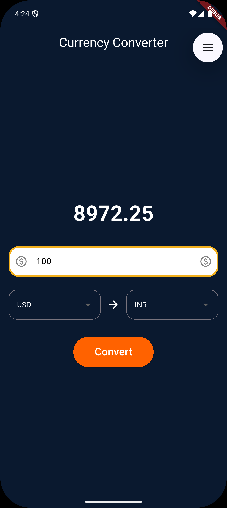

# Currency Converter App (Flutter)

A clean and efficient Android application built using Flutter that allows users to convert between different currencies with a simple and intuitive Material UI.

---

## 🚀 Features
- Convert between multiple currencies
- Clean and responsive Material UI
- Fast and lightweight performance
- Beginner-friendly Flutter project structure

---

## 🛠 Tech Stack
- Flutter
- Dart
- REST API (for exchange rates)
- Material Design

---

## 📸 Screenshots

---

## ⚙️ How to Run Locally

1. Clone the repository:
git clone https://github.com/USERNAME/currency-converter-flutter.git

2. Navigate to the project folder:
cd currency-converter-flutter

3. Install dependencies:
flutter pub get

4. Run the app:
flutter run

📦 APK Download

Download the latest APK from the Releases section of this repository.

📌 Notes

This project was built as part of learning Flutter and Android app development.

Feedback and suggestions are welcome.

👤 Author

Neil Surjiani
Flutter Developer